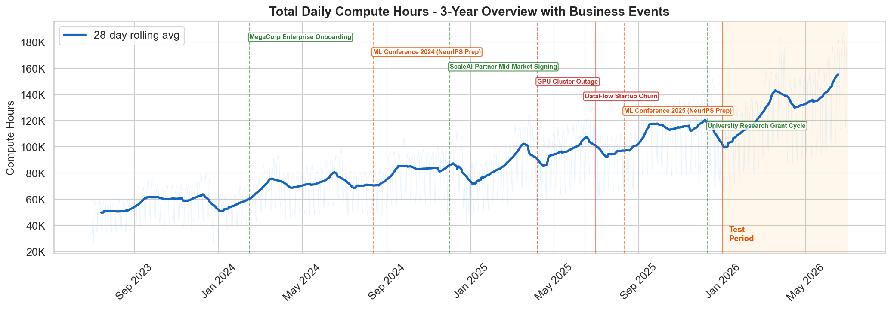
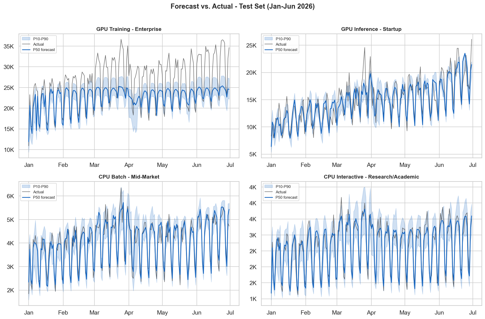
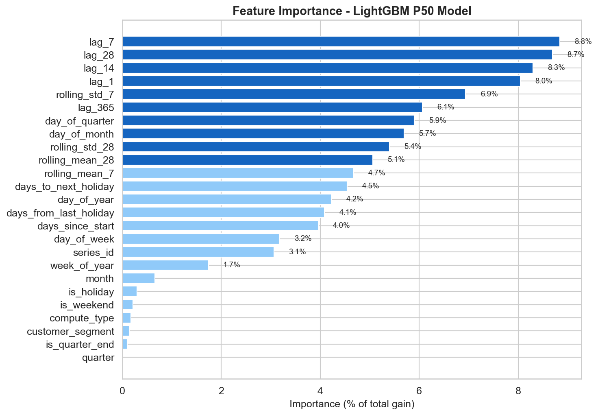

# Compute Capacity Forecasting

ML-driven capacity planning for an AI compute infrastructure company. Demonstrates end-to-end forecasting methodology — from EDA through scenario planning — on realistic synthetic data, with a hybrid trend + residual model that solves the tree-model extrapolation problem.

> **Note:** This project uses realistic synthetic data to demonstrate methodology, not production telemetry. The data simulates 16 compute series with real-world patterns (step-changes, seasonality, outages, variable growth rates). All metrics are evaluated on held-out test periods.

## The Problem

AI compute providers face a planning paradox: GPU procurement lead times are 3-6 months, but demand can grow 40-80% annually with high variance across customer segments. Order too late and customers churn to competitors. Order too early and capital sits idle.

**The question this project answers:** *When do we need to buy more GPUs, and how confident should we be in that timeline?*

## Key Results


*Total daily compute hours across 16 series (4 compute types x 4 customer segments), with documented business events.*

| Metric | Result |
|--------|--------|
| **Test MAPE** | 7.65% (vs. 10.5% growth-adjusted seasonal naive) |
| **Backtesting** | Consistent across 3 walk-forward folds (7.9%-12.8%) |
| **Coverage (P10-P90)** | 83.3% overall (GPU Training 79.7%, GPU Inference 83.1%) |
| **Top predictors** | Yesterday's value, weekly lags, rolling averages, trend |


*LightGBM P50 forecast (blue) with P10-P90 confidence bands vs. actuals (black) on held-out test set (Jan-Jun 2026).*

## Approach

**Hybrid trend + residual decomposition** separates per-series exponential growth from cyclical patterns, solving the tree-model extrapolation problem for fast-growing series. A global LightGBM model trained on all 16 series simultaneously learns shared patterns (weekly cycles, holiday effects) while categorical features capture series-specific volatility.

**Why gradient boosting over ARIMA/Prophet:** On aggregated daily totals, LightGBM Hybrid achieves 2.5% MAPE vs. Prophet at 10.7% and SARIMAX at 28.9%. This comparison is illustrative, not apples-to-apples — LightGBM benefits from disaggregated 16-series training data while Prophet/SARIMAX run on the single aggregated series. The structural advantages are real though: a global model handles all 16 series in a single fit, natively supports categorical features, and produces quantile forecasts (P10/P50/P90) without distributional assumptions.

### Growth cap sensitivity

The exponential trend's growth rate is capped to stop a steep two-year fit from extrapolating to implausible demand a year out.
The cap value was chosen by sweeping candidates from 4%/month to uncapped, selecting on the validation window, and reporting on the held-out test set (`scripts/cap_sensitivity_sweep.py`).

At the original 5%/month, the cap clipped the one genuinely fast series, GPU Inference | Startup, whose trend fits about 5.9%/month.
Raising the cap to 6% removed that clip and cut the series from 16.1% to 10.3% test MAPE, which moved overall test MAPE from 7.94% to 7.65%.
6% is the tightest cap that constrains no series' real growth, so it keeps the guard rail at no accuracy cost: tightening to 4% is worse (9.0% overall), and loosening past 6% changes nothing because no series fits faster.
The result also holds in the recursive regime the model actually deploys in (`scripts/cap_sensitivity_recursive.py`): re-running the sweep with predictions fed back as lags, overall MAPE degrades under 0.1pp at every cap, and the cap penalty on the clipped series stays about the same (5.1pp recursive vs 5.8pp single-step) rather than compounding — the trend/residual split, not lag-chasing, is doing the extrapolation.
On production data, where the true growth ceiling is unknown, the same sweep would run on a validation split, or the hard cap would be replaced by a per-type cap or a damped trend.

### Pipeline

```
EDA (51 cells)              Forecasting (72 cells)         Scenario Planning
--------------------        ----------------------         -----------------
Trend decomposition         25-feature engineering         60-day daily forecast
ACF/PACF + stationarity     Hybrid trend+residual model    3-6 month envelopes
Event impact analysis       LightGBM quantile regression   Base/High/Low scenarios
Outlier quantification      Conformal calibration (CQR)    Capacity threshold charts
Correlation structure       Walk-forward backtesting        Shortfall magnitude analysis
                            Recursive forecast validation   Cost-of-inaction framing
                            Prophet/SARIMAX comparison
                            SHAP interpretability
```

### Feature Engineering (25 features)

| Group | Features | Signal |
|-------|----------|--------|
| Calendar | day_of_week, month, quarter, is_weekend, is_quarter_end | Weekly/quarterly patterns |
| Holiday | is_holiday, days_to_next, days_from_last | 15-55% demand suppression |
| Lag | 1, 7, 14, 28, 365 days | Autoregressive structure |
| Rolling | 7d/28d mean and std | Local level and volatility |
| Trend | days_since_start | ~47% annualized growth (synthetic) |
| Categorical | compute_type, customer_segment | Series-specific patterns |
| Interaction | series_id (type x segment) | Per-series trend interaction |



## Honest Limitations

- **Synthetic data** -- the model is validated on data I designed, not production telemetry. Real compute usage has messier patterns, missing data, and distribution drift that would likely degrade performance. The methodology is the point, not the specific numbers.
- **Startup series remain noisy** -- coverage is 73% for Startup segment due to inherent demand volatility. Enterprise and Mid-Market exceed 85%.
- **Hyperparameters not tuned** -- sensible defaults, not optimized via grid search.
- **Recursive forecast validated** -- single-step MAPE (7.63%) matches recursive 6-month MAPE (7.65%), confirming the hybrid decomposition produces stable recursive forecasts.

## Production Considerations

### Why P90 for capacity planning

GPU stockouts and idle capacity have asymmetric costs. A stockout means Enterprise customers hit quota limits, trigger SLA penalties, and potentially churn to competitors — a revenue impact that dwarfs the carrying cost of idle GPUs for a few weeks. P90 (rather than P75 or P95) balances this asymmetry: it provides a ~90% probability of meeting demand while keeping the over-provisioning buffer reasonable. For the highest-value GPU Training series, P95 may be worth the extra capital given the churn risk.

### Model monitoring and retraining

In production, this model would need drift detection to trigger retraining:

- **Rolling MAPE tracking**: Compute 28-day rolling MAPE per compute type. If any series exceeds 15% (roughly 2x the baseline) for 7+ consecutive days, flag for investigation.
- **Coverage monitoring**: Track whether actuals fall within P10-P90 bands. If weekly coverage drops below 70% (vs. the 80% target), the conformal calibration needs refreshing.
- **Trend break detection**: A major customer onboarding or churn will cause a step-change the model can't predict from lagged features alone. Monitor for residuals that are consistently one-directional for 5+ days.
- **Retraining cadence**: Monthly retraining with a rolling 24-month window, plus ad-hoc retraining after documented business events (onboardings, outages, pricing changes).

## Dataset

36 months of daily compute hours (Jul 2023 - Jun 2026) across 4 compute types and 4 customer segments (17,536 rows). Key characteristics:

- **GPU Inference** grew 5.4x (inference boom); **CPU Batch** grew 1.7x (mature)
- **Startups** grew 5.6x from small base; **Research/Academic** near-flat at 1.6x
- 4 step-changes (3 onboardings + 1 churn), 2 conference spikes, 1 GPU outage
- Weekly seasonality (30-50% weekend drop), tiered holiday effects, quarterly pushes

## Project Structure

```
compute-forecasting/
├── notebooks/
│   ├── 01_eda.ipynb                    # Exploratory analysis (51 cells)
│   ├── 02_forecasting.ipynb            # LightGBM model + Prophet/SARIMAX comparison (72 cells)
│   └── 03_scenarios.ipynb              # Scenario planning + shortfall analysis (32 cells)
├── src/compute_forecasting/
│   └── features.py                     # Feature engineering + hybrid model support
├── data/
│   ├── generate_synthetic_data.py      # Deterministic data generator (seed=42)
│   ├── compute_usage.csv               # 17,536 rows
│   ├── event_log.csv                   # 7 documented business events
│   └── holiday_calendar.csv            # US federal holidays (tiered severity)
└── outputs/figures/                    # Key visualizations
```

## How to Run

```bash
pip install -e ".[dev]"
python data/generate_synthetic_data.py    # regenerate data (deterministic)
jupyter notebook notebooks/01_eda.ipynb   # run notebooks in order
```

## Tech Stack

Python 3.11 | LightGBM | pandas | scikit-learn | SHAP | Prophet | statsmodels | matplotlib/seaborn
